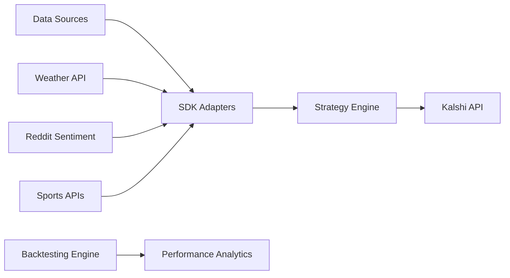

# 🧠 Neural SDK

> **Open-source Python SDK for algorithmic prediction market trading**  
> Build sophisticated trading strategies with **real-time WebSocket streaming** and comprehensive backtesting

[](https://opensource.org/licenses/MIT)
[](https://www.python.org/downloads/)
[](https://badge.fury.io/py/neural-sdk)
[](https://github.com/neural/neural-sdk/releases)

## 🔥 What's New in v1.1.0

**Real-time WebSocket Streaming is here!** Connect directly to Kalshi's WebSocket API for instant market data updates.

```python
from neural_sdk import NeuralSDK

sdk = NeuralSDK.from_env()

# NEW: Real-time WebSocket streaming
websocket = sdk.create_websocket()

@websocket.on_market_data
async def handle_live_data(data):
    print(f"🔴 LIVE: {data.ticker} = ${data.yes_price}")

await websocket.connect()
await websocket.subscribe_markets(['KXNFLGAME*'])  # All NFL games
```

**🏈 NFL Market Streaming**: Specialized support for NFL prediction markets with automatic game detection.

## 🚀 Quick Start

### Installation

#### For Team Members (Private Access)
```bash
# Install latest Neural SDK v1.1.0 with WebSocket streaming
pip install git+https://github.com/IntelIP/Neural-Trading-Platform.git@v1.1.0

# Or with uv (recommended - faster)
uv add git+https://github.com/IntelIP/Neural-Trading-Platform.git@v1.1.0

# For development
git clone https://github.com/IntelIP/Neural-Trading-Platform.git
cd Neural-Trading-Platform
pip install -e .
```

#### Authentication Setup
```bash
# One-time setup for team members
git config --global credential.helper store

# Or use SSH (more secure)
ssh-keygen -t ed25519 -C "your-email@company.com"
# Add public key to GitHub account
```

### Basic Usage

```python
from neural_sdk import NeuralSDK

# Initialize SDK
sdk = NeuralSDK.from_env()

# Create a simple strategy
@sdk.strategy
async def momentum_strategy(market_data):
    for symbol, price in market_data.prices.items():
        if 'NFL' in symbol and price < 0.3:
            return sdk.create_signal('BUY', symbol, size=100)

# Start trading
await sdk.start_trading()
```

### Backtesting

```python
from neural_sdk.backtesting import BacktestEngine, BacktestConfig

# Configure backtest
config = BacktestConfig(
    start_date="2024-01-01",
    end_date="2024-12-31", 
    initial_capital=10000
)

# Run backtest
engine = BacktestEngine(config)
engine.add_strategy(my_strategy)
engine.load_data("csv", path="historical_data.csv")

results = engine.run()
print(f"Total Return: {results.total_return:.2f}%")
print(f"Sharpe Ratio: {results.metrics['sharpe_ratio']:.3f}")
```

## 🏗️ Architecture



## 📊 Features

### Core Trading
- **Real-time market data** streaming from multiple sources
- **Strategy framework** with easy-to-use decorators
- **Risk management** with position limits and stop-losses
- **Order execution** with realistic slippage simulation

### Backtesting
- **Event-driven engine** for accurate historical testing
- **Multiple data sources**: CSV, Parquet, SQL, S3
- **Performance metrics**: Sharpe ratio, drawdown, win rate
- **Portfolio simulation** with realistic costs and slippage

### Data Integration
- **Plugin architecture** for custom data sources
- **Built-in adapters** for weather, Reddit, sports APIs
- **Data caching** for improved performance
- **Format standardization** across all sources

## 🛠️ Data Sources

| Source | Status | Purpose | Setup |
|--------|--------|---------|-------|
| **Weather API** | ✅ Ready | Weather impacts on sports | Free API key |
| **Reddit** | ✅ Ready | Sentiment analysis | Free API credentials |
| **Custom CSV** | ✅ Ready | Historical data | Local files |
| **Parquet** | ✅ Ready | High-performance data | S3 or local |
| **PostgreSQL** | ⚙️ Optional | Large datasets | Database connection |

## 📈 Strategy Examples

### Momentum Strategy
```python
def momentum_strategy(market_data):
    \"\"\"Buy markets trending upward below 60 cents\"\"\"
    for symbol, price in market_data.prices.items():
        if price < 0.6 and market_data.is_trending_up(symbol):
            return {'action': 'BUY', 'symbol': symbol, 'size': 50}
```

### Mean Reversion
```python  
def mean_reversion_strategy(market_data):
    \"\"\"Buy undervalued markets, sell overvalued\"\"\"
    for symbol, price in market_data.prices.items():
        if price < 0.3:  # Undervalued
            return {'action': 'BUY', 'symbol': symbol, 'size': 100}
        elif price > 0.7:  # Overvalued  
            return {'action': 'SELL', 'symbol': symbol, 'size': 100}
```

## 🔧 Configuration

### Environment Setup
```bash
# Create .env file
NEURAL_API_KEY_ID=your_neural_api_key
NEURAL_PRIVATE_KEY_FILE=./keys/neural_private.key

# Optional: Data source APIs
OPENWEATHER_API_KEY=your_weather_key
REDDIT_CLIENT_ID=your_reddit_id
REDDIT_CLIENT_SECRET=your_reddit_secret
```

### SDK Configuration
```python
from neural_sdk import SDKConfig

config = SDKConfig(
    max_position_size=0.05,  # Max 5% per position
    daily_loss_limit=0.20,   # Stop at 20% daily loss
    commission=0.02,         # Kalshi's 2% fee
    slippage=0.01           # 1% estimated slippage
)

sdk = KalshiSDK(config)
```

## 📚 Documentation

| Document | Description |
|----------|-------------|
| [**Getting Started**](docs/getting_started.md) | Installation and first strategy |
| [**API Reference**](docs/api_reference.md) | Complete SDK documentation |
| [**Backtesting Guide**](docs/backtesting.md) | Historical testing framework |
| [**Data Sources**](docs/data_sources.md) | Setting up data feeds |
| [**Strategy Development**](docs/strategies.md) | Building trading algorithms |

## 🧪 Testing

```bash
# Run all tests
pytest tests/

# Run specific test suite  
pytest tests/unit/test_backtesting.py

# Run with coverage
pytest --cov=kalshi_trading_sdk tests/
```

## 📊 Performance Metrics

The SDK calculates comprehensive metrics for strategy evaluation:

- **Return Metrics**: Total return, CAGR, Sharpe ratio
- **Risk Metrics**: Max drawdown, volatility, VaR
- **Trade Analysis**: Win rate, average win/loss, profit factor
- **Time Analysis**: Best/worst days, consecutive wins/losses

## 🌟 Example Results

```
BACKTEST RESULTS
================
Period: 2024-01-01 to 2024-12-31
Initial Capital: $10,000.00
Final Value: $12,750.00

Total Return: +27.5%
Sharpe Ratio: 1.85
Max Drawdown: -8.2%
Win Rate: 68.5%
Total Trades: 156
```

## 🤝 Contributing

We welcome contributions! Please see [CONTRIBUTING.md](CONTRIBUTING.md) for guidelines.

### Development Setup
```bash
git clone https://github.com/neural/neural-sdk.git
cd neural-sdk

# Install development dependencies
pip install -e ".[dev]"

# Run pre-commit hooks
pre-commit install
```

## 📄 License

This project is licensed under the MIT License - see the [LICENSE](LICENSE) file for details.

## ⚠️ Disclaimer

**Important**: This software is for educational and research purposes. Trading involves substantial risk of loss. 

- Always start with paper trading
- Never risk more than you can afford to lose  
- Past performance doesn't guarantee future results
- The SDK is not financial advice

## 🔗 Links

- **Documentation**: [https://kalshi-trading-sdk.readthedocs.io/](https://kalshi-trading-sdk.readthedocs.io/)
- **PyPI Package**: [https://pypi.org/project/kalshi-trading-sdk/](https://pypi.org/project/kalshi-trading-sdk/)
- **Issues**: [https://github.com/kalshi/kalshi-trading-sdk/issues](https://github.com/kalshi/kalshi-trading-sdk/issues)
- **Discussions**: [https://github.com/kalshi/kalshi-trading-sdk/discussions](https://github.com/kalshi/kalshi-trading-sdk/discussions)

## 🏆 Acknowledgments

- Kalshi for providing the trading platform
- Contributors and beta testers
- Open source community for excellent libraries

---

**Built for algorithmic trading • Trade responsibly • Performance matters**