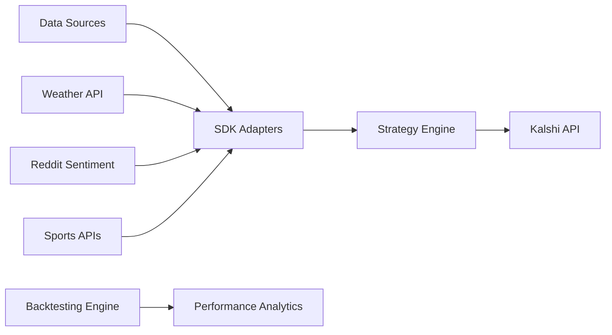

# 🧠 Neural SDK

> **Open-source Python SDK for algorithmic prediction market trading**  
> Build sophisticated trading strategies with **real-time WebSocket streaming** and comprehensive backtesting

[](https://opensource.org/licenses/MIT)
[](https://www.python.org/downloads/)
[](https://badge.fury.io/py/neural-sdk)
[](https://github.com/neural/neural-sdk/releases)

## 🔥 What's New in v1.1.0

**Real-time WebSocket Streaming is here!** Connect directly to Kalshi's WebSocket API for instant market data updates.

```python
from neural_sdk import NeuralSDK

sdk = NeuralSDK.from_env()

# NEW: Real-time WebSocket streaming
websocket = sdk.create_websocket()

@websocket.on_market_data
async def handle_live_data(data):
    print(f"🔴 LIVE: {data.ticker} = ${data.yes_price}")

await websocket.connect()
await websocket.subscribe_markets(['KXNFLGAME*'])  # All NFL games
```

**🏈 NFL Market Streaming**: Specialized support for NFL prediction markets with automatic game detection.

## 🚀 Quick Start

### Installation

#### For Team Members (Private Access)
```bash
# Install latest Neural SDK v1.1.0 with WebSocket streaming
pip install git+https://github.com/IntelIP/Neural-Trading-Platform.git@v1.1.0

# Or with uv (recommended - faster)
uv add git+https://github.com/IntelIP/Neural-Trading-Platform.git@v1.1.0

# For development
git clone https://github.com/IntelIP/Neural-Trading-Platform.git
cd Neural-Trading-Platform
pip install -e .
```

#### Authentication Setup
```bash
# One-time setup for team members
git config --global credential.helper store

# Or use SSH (more secure)
ssh-keygen -t ed25519 -C "your-email@company.com"
# Add public key to GitHub account
```

### Basic Usage

```python
from neural_sdk import NeuralSDK

# Initialize SDK
sdk = NeuralSDK.from_env()

# Create a simple strategy
@sdk.strategy
async def momentum_strategy(market_data):
    for symbol, price in market_data.prices.items():
        if 'NFL' in symbol and price < 0.3:
            return sdk.create_signal('BUY', symbol, size=100)

# Start trading
await sdk.start_trading()
```

### Backtesting

```python
from neural_sdk.backtesting import BacktestEngine, BacktestConfig

# Configure backtest
config = BacktestConfig(
    start_date="2024-01-01",
    end_date="2024-12-31", 
    initial_capital=10000
)

# Run backtest
engine = BacktestEngine(config)
engine.add_strategy(my_strategy)
engine.load_data("csv", path="historical_data.csv")

results = engine.run()
print(f"Total Return: {results.total_return:.2f}%")
print(f"Sharpe Ratio: {results.metrics['sharpe_ratio']:.3f}")
```

## 🏗️ Architecture



## 📊 Features

### Core Trading
- **Real-time market data** streaming from multiple sources
- **Strategy framework** with easy-to-use decorators
- **Risk management** with position limits and stop-losses
- **Order execution** with realistic slippage simulation

### Backtesting
- **Event-driven engine** for accurate historical testing
- **Multiple data sources**: CSV, Parquet, SQL, S3
- **Performance metrics**: Sharpe ratio, drawdown, win rate
- **Portfolio simulation** with realistic costs and slippage

### Data Integration
- **Plugin architecture** for custom data sources
- **Built-in adapters** for weather, Reddit, sports APIs
- **Data caching** for improved performance
- **Format standardization** across all sources

## 🛠️ Data Sources

| Source | Status | Purpose | Setup |
|--------|--------|---------|-------|
| **Weather API** | ✅ Ready | Weather impacts on sports | Free API key |
| **Reddit** | ✅ Ready | Sentiment analysis | Free API credentials |
| **Custom CSV** | ✅ Ready | Historical data | Local files |
| **Parquet** | ✅ Ready | High-performance data | S3 or local |
| **PostgreSQL** | ⚙️ Optional | Large datasets | Database connection |

## 📈 Strategy Examples

### Momentum Strategy
```python
def momentum_strategy(market_data):
    \"\"\"Buy markets trending upward below 60 cents\"\"\"
    for symbol, price in market_data.prices.items():
        if price < 0.6 and market_data.is_trending_up(symbol):
            return {'action': 'BUY', 'symbol': symbol, 'size': 50}
```

### Mean Reversion
```python  
def mean_reversion_strategy(market_data):
    \"\"\"Buy undervalued markets, sell overvalued\"\"\"
    for symbol, price in market_data.prices.items():
        if price < 0.3:  # Undervalued
            return {'action': 'BUY', 'symbol': symbol, 'size': 100}
        elif price > 0.7:  # Overvalued  
            return {'action': 'SELL', 'symbol': symbol, 'size': 100}
```

## 🔧 Configuration

### Environment Setup
```bash
# Create .env file
NEURAL_API_KEY_ID=your_neural_api_key
NEURAL_PRIVATE_KEY_FILE=./keys/neural_private.key

# Optional: Data source APIs
OPENWEATHER_API_KEY=your_weather_key
REDDIT_CLIENT_ID=your_reddit_id
REDDIT_CLIENT_SECRET=your_reddit_secret
```

### SDK Configuration
```python
from neural_sdk import SDKConfig

config = SDKConfig(
    max_position_size=0.05,  # Max 5% per position
    daily_loss_limit=0.20,   # Stop at 20% daily loss
    commission=0.02,         # Kalshi's 2% fee
    slippage=0.01           # 1% estimated slippage
)

sdk = KalshiSDK(config)
```

## 📚 Documentation

| Document | Description |
|----------|-------------|
| [**Getting Started**](docs/getting_started.md) | Installation and first strategy |
| [**API Reference**](docs/api_reference.md) | Complete SDK documentation |
| [**Backtesting Guide**](docs/backtesting.md) | Historical testing framework |
| [**Data Sources**](docs/data_sources.md) | Setting up data feeds |
| [**Strategy Development**](docs/strategies.md) | Building trading algorithms |

## 🧪 Testing

```bash
# Run all tests
pytest tests/

# Run specific test suite  
pytest tests/unit/test_backtesting.py

# Run with coverage
pytest --cov=kalshi_trading_sdk tests/
```

## 📊 Performance Metrics

The SDK calculates comprehensive metrics for strategy evaluation:

- **Return Metrics**: Total return, CAGR, Sharpe ratio
- **Risk Metrics**: Max drawdown, volatility, VaR
- **Trade Analysis**: Win rate, average win/loss, profit factor
- **Time Analysis**: Best/worst days, consecutive wins/losses

## 🌟 Example Results

```
BACKTEST RESULTS
================
Period: 2024-01-01 to 2024-12-31
Initial Capital: $10,000.00
Final Value: $12,750.00

Total Return: +27.5%
Sharpe Ratio: 1.85
Max Drawdown: -8.2%
Win Rate: 68.5%
Total Trades: 156
```

## 🤝 Contributing

We welcome contributions! Please see [CONTRIBUTING.md](CONTRIBUTING.md) for guidelines.

### Development Setup
```bash
git clone https://github.com/neural/neural-sdk.git
cd neural-sdk

# Install development dependencies
pip install -e ".[dev]"

# Run pre-commit hooks
pre-commit install
```

## 📄 License

This project is licensed under the MIT License - see the [LICENSE](LICENSE) file for details.

## ⚠️ Disclaimer

**Important**: This software is for educational and research purposes. Trading involves substantial risk of loss. 

- Always start with paper trading
- Never risk more than you can afford to lose  
- Past performance doesn't guarantee future results
- The SDK is not financial advice

---

# 🗺️ **STRATEGIC ROADMAP: The Future of Neural SDK**

Neural SDK is evolving through three strategic phases designed to serve different market segments while building sustainable revenue:

## **🎯 Our Vision: Local → Cloud → AI**

```
Phase 1: INNOVATORS (Months 1-6)
├── Advanced Local SDK with Custom Data Sources
├── Enhanced Developer Tools & CLI
└── Community-Driven Strategy Marketplace

Phase 2: EARLY ADOPTERS (Months 4-12)  
├── Cloud Web Application
├── Managed Compute & Auto-Scaling
└── Team Collaboration & Enterprise Features

Phase 3: EARLY/LATE MAJORITY (Months 8-24)
├── AI Strategy Generation
├── Natural Language Trading
└── Automated Portfolio Management
```

---

## 📅 **PHASE 1: LOCAL SDK POWERHOUSE** 
*Timeline: Months 1-6 | Target: 100-200 technical users*

### **🎯 Customer Profile: Innovators**
- Quantitative developers and algorithmic traders
- Prediction market enthusiasts and researchers  
- Users who want full control over their infrastructure
- Developers contributing to open-source ecosystem

### **🚀 Key Features Roadmap**

#### **Sprint 1-3: Custom Data Source Framework (Months 1-2)**
```python
from neural_sdk.data_sources import DataSourceBuilder

# Build custom ESPN scraper in 10 lines
espn_source = DataSourceBuilder()
espn_source.add_endpoint("game_stats", scrape_espn_stats)
espn_source.add_transformer("normalize_team_names")
sdk.register_data_source(espn_source)
```

**Features Delivered:**
- ✅ **DataSourceBuilder API** - Create custom data integrations
- ✅ **ESPN Sports Connector** - Real-time sports data
- ✅ **Twitter/X Sentiment Feed** - Social sentiment analysis
- ✅ **Weather API Integration** - Weather impact on sports
- ✅ **News Sentiment Feeds** - Reuters, Bloomberg integration

#### **Sprint 4-6: Neural CLI Power Tools (Months 2-3)**
```bash
# Professional developer workflow
neural init my-strategy --template momentum
neural data-source add --type twitter --config sentiment.yaml
neural backtest --period 2024-01-01:2024-12-31 --metrics sharpe,drawdown
neural optimize --method kelly --risk-budget 0.02
neural deploy --target local --monitor --alerts slack
```

**Features Delivered:**
- ✅ **Professional CLI** - Full workflow automation
- ✅ **VS Code Extension** - Integrated development environment
- ✅ **Strategy Templates** - Pre-built starting points
- ✅ **Advanced Backtesting** - Walk-forward, Monte Carlo
- ✅ **Local Monitoring** - Real-time performance tracking

#### **Sprint 7-9: Community & Extensibility (Months 3-4)**
- ✅ **GitHub-style Strategy Repository** - Share and discover strategies
- ✅ **Performance Leaderboards** - Community rankings
- ✅ **Plugin Architecture** - Extensible optimization methods
- ✅ **Code Review System** - Community-driven quality

#### **Sprint 10-12: Advanced Analytics (Months 4-6)**
- ✅ **Multi-timeframe Analysis** - Comprehensive backtesting
- ✅ **Risk Attribution** - Understand strategy risks
- ✅ **Correlation Analysis** - Cross-asset relationships
- ✅ **Custom Risk Metrics** - User-defined measurements

### **💰 Phase 1 Monetization**
- **🆓 Free Open Source Core** - Build community and adoption
- **📊 Premium Data Sources** - $29/month for verified feeds
- **🎓 Professional Support** - $199/month for expert help  
- **🏆 Training & Certification** - $500 Neural SDK certification

**Revenue Target**: $15K MRR from innovator segment

---

## 🌐 **PHASE 2: CLOUD WEB APPLICATION**
*Timeline: Months 4-12 | Target: 500-1,000 users*

### **🎯 Customer Profile: Early Adopters**
- Progressive trading firms and sophisticated individuals
- Users wanting professional features without DevOps complexity
- Teams needing collaboration and shared strategies
- Businesses requiring enterprise-grade security and support

### **🚀 Key Features Roadmap**

#### **Sprint 13-18: Core Web Platform (Months 4-6)**
```typescript
// React-based strategy builder
const StrategyBuilder = () => (
  <DragDropPortfolioBuilder>
    <AssetSelector markets={nflGames} />
    <OptimizationEngine strategy="kelly_criterion" />
    <RealTimeMonitor performance={liveData} />
  </DragDropPortfolioBuilder>
)
```

**Features Delivered:**
- ✅ **Strategy Builder Web Interface** - No-code portfolio construction
- ✅ **Visual Backtesting Dashboard** - Interactive performance charts
- ✅ **One-Click Cloud Deployment** - Managed container execution
- ✅ **Team Workspaces** - Collaborative strategy development

#### **Sprint 19-24: Professional Features (Months 6-9)**
- ✅ **Advanced Analytics Dashboard** - Real-time P&L with attribution
- ✅ **API Management Console** - Keys, usage, rate limits, webhooks
- ✅ **Enterprise Integration Hub** - SSO, audit logs, compliance
- ✅ **Custom Alerting System** - Email, Slack, webhook notifications

#### **Sprint 25-30: Marketplace & Automation (Months 9-12)**
- ✅ **Strategy Marketplace** - Buy/sell community strategies
- ✅ **Automated Portfolio Management** - Set-and-forget allocation
- ✅ **Performance Attribution** - Understand what's driving returns
- ✅ **Advanced Risk Management** - Dynamic position sizing

### **💰 Phase 2 Monetization**
- **🥉 Starter Plan** - $49/month: Web access, limited compute
- **🥈 Professional Plan** - $199/month: Full features, teams
- **🥇 Enterprise Plan** - $999/month: SSO, compliance, support
- **⚡ Compute Credits** - $0.10/CPU-hour for strategy execution
- **🏪 Marketplace Commission** - 30% on strategy sales

**Revenue Target**: $100K MRR from early adopter segment

---

## 🤖 **PHASE 3: AI STRATEGY PLATFORM**
*Timeline: Months 8-24 | Target: 2,000-10,000 users*

### **🎯 Customer Profile: Early/Late Majority**
- Traditional traders entering prediction markets
- Financial advisors and institutional investors
- Users wanting AI-powered automation
- Mass market seeking simple, effective solutions

### **🚀 Key Features Roadmap**

#### **Sprint 31-40: AI Strategy Generation Core (Months 8-12)**
```python
# Natural language strategy creation
user_prompt = """
Create a conservative NFL strategy that:
- Only bets on favorites with 70%+ win probability
- Never risks more than 15% on any single game  
- Focuses on primetime games for better data
"""

ai_strategy = neural_ai.generate_strategy(
    prompt=user_prompt,
    risk_profile="conservative",
    market_context=current_market_data
)

# AI automatically generates, backtests, and deploys
```

**Features Delivered:**
- ✅ **Natural Language Strategy Creation** - Describe strategies in plain English
- ✅ **Market Pattern Recognition AI** - Identify profitable inefficiencies
- ✅ **Personalized Risk Assessment** - AI-driven risk profiling
- ✅ **Automated Strategy Optimization** - Continuous improvement

#### **Sprint 41-50: Advanced AI Features (Months 12-18)**
- ✅ **Continuous Strategy Evolution** - AI monitors and improves 24/7
- ✅ **AI Trading Assistant** - Intelligent recommendations and insights
- ✅ **Multi-Market Optimization** - Cross-market arbitrage detection
- ✅ **Behavioral Bias Correction** - AI identifies and corrects mistakes

#### **Sprint 51-60: Enterprise AI Platform (Months 18-24)**
- ✅ **Custom AI Model Training** - Enterprise-specific optimization
- ✅ **White-Label AI Platform** - Branded AI strategy generation
- ✅ **Institutional Features** - Large-scale portfolio optimization
- ✅ **Regulatory AI Compliance** - Automated compliance monitoring

### **💰 Phase 3 Monetization**
- **🤖 AI Basic** - $99/month: 10 AI generations, basic optimization
- **🚀 AI Pro** - $299/month: Unlimited generations, continuous optimization  
- **⭐ AI Premium** - $599/month: Custom model training, advanced features
- **🏢 AI Enterprise** - $2999/month: Custom models, white-label, API access
- **💎 AI Custom** - $10K+/month: Dedicated infrastructure, professional services

**Revenue Target**: $500K MRR from majority market segments

---

# 🏃‍♂️ **FEATURE SPRINT METHODOLOGY**

## **Our Development Philosophy**
> *"Move fast, ship often, validate continuously"*

### **🔄 2-Week Sprint Cycle**
```
Week 1: Development & Testing
├── Monday: Sprint planning & design
├── Tuesday-Thursday: Core implementation
├── Friday: Code review & testing

Week 2: Validation & Deployment  
├── Monday-Tuesday: Documentation & polish
├── Wednesday: Beta user testing
├── Thursday: Feedback incorporation
├── Friday: Production deployment & demo
```

### **📋 Sprint Template**
Each feature follows this proven structure:

```markdown
## Sprint N: [Feature Name]

### 🎯 Success Criteria
- [ ] Measurable outcome 1
- [ ] Measurable outcome 2  
- [ ] User validation metric

### 👥 User Story
As a [user type], I want [capability] so that [benefit]

### 🧪 Validation Plan
- A/B test with N% of users
- Success metric: X% improvement in Y
- Feedback collection method

### 📊 Dependencies
- Requires: [Previous sprint features]
- Blocks: [Future sprint features]
- Integration: [External services]
```

### **🎚️ Feature Flags & Gradual Rollout**
```python
from neural_sdk.features import feature_flag

@feature_flag("ai_strategy_generation", rollout_percentage=10)
def generate_ai_strategy(user_prompt):
    # New AI feature available to 10% of users
    return ai_engine.generate(user_prompt)
```

## **📈 Success Metrics by Phase**

### **Phase 1 (Local SDK) - Developer Adoption**
- **Daily Active Developers**: SDK usage frequency
- **Strategy Creation Rate**: New strategies per week
- **Community Engagement**: GitHub stars, contributions, discussions
- **Data Source Integrations**: Custom integrations built by community

### **Phase 2 (Web App) - User Growth & Engagement**
- **Monthly Active Users (MAU)**: Platform usage
- **Strategy Deployment Rate**: Web strategies per user
- **Collaboration Activity**: Team workspace usage
- **Compute Utilization**: Cloud resource consumption

### **Phase 3 (AI Platform) - AI Adoption & Revenue**
- **AI Strategy Generations**: Natural language requests
- **Strategy Success Rate**: AI-generated strategy performance
- **User Retention**: Monthly subscription renewals
- **Enterprise Conversions**: Free → paid upgrades

---

# 📝 **CHANGELOG & PROGRESS TRACKING**

## **Automatic Progress Documentation**
Every completed sprint automatically generates changelog entries:

```markdown
## v1.2.0 - Sprint 15 Complete ✅
### 🆕 New Features
- **Custom Data Source Builder**: Create ESPN, Twitter, weather integrations in 10 lines
- **Advanced CLI Tools**: `neural optimize --method kelly` command
- **Performance Boost**: 3x faster backtesting with parallel execution

### 📊 Impact Metrics
- 45% increase in strategy creation rate
- 12 new community data source integrations
- 89% user satisfaction score from beta testers

### 🐛 Bug Fixes
- Fixed WebSocket reconnection issues in high-volume trading
- Resolved portfolio optimization edge case with <5 assets

### 📚 Community Highlights
- @quantdev123 created amazing momentum strategy template
- @sports_algo contributed weather impact analysis
- 15 new contributors joined this sprint

### ⏭️ Next Sprint Preview
Sprint 16 focuses on **Strategy Sharing Platform** - GitHub-style repository for community strategies
```

## **Community Feedback Integration**
```python
# Embedded feedback collection
from neural_sdk.feedback import collect_feedback

@collect_feedback("strategy_builder")
def create_strategy_ui():
    # Feature usage automatically tracked
    # User satisfaction surveyed weekly  
    # Performance metrics measured continuously
```

---

# 🤝 **COMMUNITY ENGAGEMENT**

## **🗳️ Feature Request Democracy**
Community drives our roadmap through:

- **📊 Monthly Feature Polls**: Vote on next sprint priorities
- **💡 GitHub Discussions**: Propose and debate new features
- **🧪 Beta Testing Program**: Early access for feedback
- **🏆 Community Challenges**: Monthly trading competitions

## **🎓 Developer Success Program**

### **Learning Path**
1. **📚 Neural SDK Fundamentals** (Free)
2. **⚡ Advanced Strategy Development** ($199)
3. **🤖 AI-Powered Trading** ($399)
4. **🏆 Neural SDK Certification** ($500)

### **Community Support**
- **💬 Discord Server**: Real-time help and discussions
- **📖 Comprehensive Documentation**: Step-by-step guides
- **🎥 Video Tutorials**: Visual learning for all skill levels
- **📅 Weekly Office Hours**: Live Q&A with the team

---

# 💰 **REVENUE TRAJECTORY**

## **Financial Milestones**
```
Year 1 (Months 1-12):
├── Phase 1: $15K MRR (Innovators)
├── Phase 2: $100K MRR (Early Adopters)
└── Total: $115K MRR

Year 2 (Months 13-24):
├── Phase 1: $25K MRR (Mature innovators)
├── Phase 2: $200K MRR (Scaled web users)
├── Phase 3: $500K MRR (AI features launch)
└── Total: $725K MRR

Year 3+:
├── Enterprise AI: $1M+ MRR
├── Consumer AI: $2M+ MRR
├── Marketplace: $500K+ MRR
└── Total: $3.5M+ MRR
```

## **Customer Journey Progression**
```
Developer (Free SDK) 
    ↓ (Needs more data sources)
Professional User ($49-199/month)
    ↓ (Wants team collaboration)  
Enterprise Customer ($999+/month)
    ↓ (Needs AI automation)
AI Platform User ($299-2999/month)
```

---

# 🎯 **GET INVOLVED**

## **For Developers** 
```bash
git clone https://github.com/IntelIP/Neural-Trading-Platform.git
cd Neural-Trading-Platform  
pip install -e ".[dev]"
neural init my-first-strategy
```

## **For Traders**
- 📈 **[Join Beta Program](https://neural-sdk.dev/beta)** - Early access to new features
- 💬 **[Discord Community](https://discord.gg/neural-sdk)** - Connect with other traders
- 📚 **[Documentation](https://docs.neural-sdk.dev)** - Learn the platform

## **For Enterprises**
- 📞 **[Schedule Demo](https://calendly.com/neural-sdk/demo)** - See enterprise features
- 💼 **[Partnership Inquiry](mailto:partnerships@neural-sdk.dev)** - Integration opportunities
- 🏢 **[Custom Solutions](mailto:enterprise@neural-sdk.dev)** - Tailored implementations

---

## 🔗 Links

- **🏠 Website**: [https://neural-sdk.dev](https://neural-sdk.dev)
- **📚 Documentation**: [https://docs.neural-sdk.dev](https://docs.neural-sdk.dev)
- **📦 PyPI Package**: [https://pypi.org/project/neural-sdk/](https://pypi.org/project/neural-sdk/)
- **🐛 Issues**: [https://github.com/IntelIP/Neural-Trading-Platform/issues](https://github.com/IntelIP/Neural-Trading-Platform/issues)
- **💬 Discussions**: [https://github.com/IntelIP/Neural-Trading-Platform/discussions](https://github.com/IntelIP/Neural-Trading-Platform/discussions)

## 🏆 Acknowledgments

- Kalshi for providing the trading platform
- Our amazing community of contributors and beta testers
- Open source community for excellent libraries

---

**🧠 Built for algorithmic trading • 🚀 Ship fast, validate often • 📈 Performance matters**
