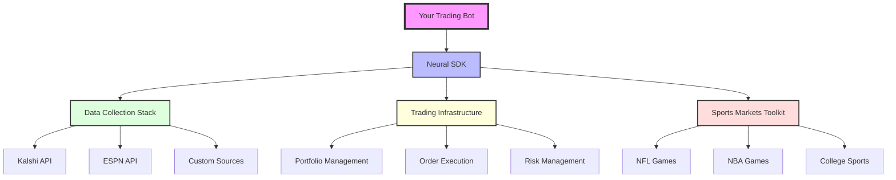
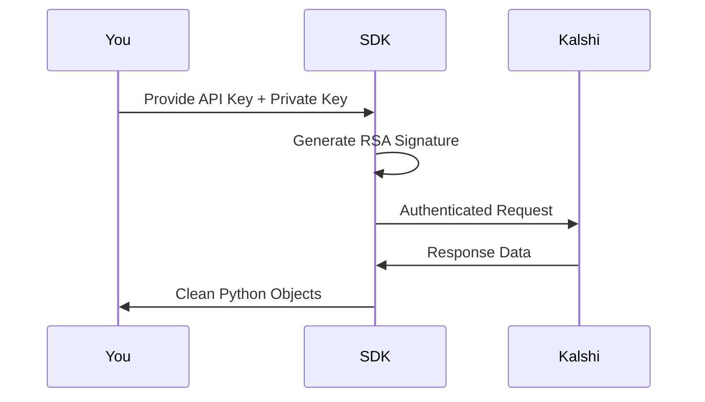

# 🏗️ Neural SDK Architecture

<Note>
Think of Neural SDK like a **kitchen with three sections**:
1. **Pantry** (Data Collection) - Where you get ingredients
2. **Stove** (Trading Infrastructure) - Where you cook (execute trades)
3. **Recipe Book** (Sports Toolkit) - Special instructions for sports markets
</Note>

## 📐 The Big Picture



## 📦 Stack #1: Data Collection

**Purpose:** Get market data into your Python code as DataFrames

### What It Does
- Connects to multiple data sources (Kalshi, ESPN, Twitter)
- Handles authentication automatically
- Transforms messy API responses into clean DataFrames
- Supports both real-time streaming and batch collection

### Key Components

```python
# The base class all data sources inherit from
from neural.data_collection import DataSource

# Pre-built sources ready to use
from neural.data_collection import (
    KalshiMarketsSource,  # Kalshi market data
    RestApiSource,        # Any REST API
    WebSocketSource       # Real-time streaming
)
```

### How It Works

<Steps>
  <Step title="Initialize a Data Source">
    ```python
    source = KalshiMarketsSource(
        series_ticker="KXNFLGAME",  # What to fetch
        status=None,                 # Don't filter
        use_authenticated=True        # Use your API keys
    )
    ```
  </Step>
  <Step title="Connect to the API">
    ```python
    async with source:
        # Connection handled automatically
    ```
  </Step>
  <Step title="Collect Data">
    ```python
    async for df in source.collect():
        print(f"Got {len(df)} markets")
        # df is a pandas DataFrame
    ```
  </Step>
</Steps>

<Warning>
**IMPORTANT:** Data sources are ASYNC. You must use `async/await` or they won't work!
</Warning>

## 💸 Stack #2: Trading Infrastructure

**Purpose:** Execute trades and manage your portfolio

### What It Does
- Authenticates with Kalshi using RSA signatures
- Checks account balance and positions
- Places market and limit orders
- Manages stop losses and position sizing

### Key Components

```python
from neural.trading import TradingClient

# Initialize authenticated client
client = TradingClient()

# Access different APIs
client.portfolio   # Check balance, positions
client.markets     # Get market data
client.exchange    # Place orders
```

### Authentication Flow



<Note>
**Security:** Your private key NEVER leaves your machine. The SDK only sends signatures.
</Note>

## 🏈 Stack #3: Sports Markets Toolkit

**Purpose:** Find and trade sports markets with the CORRECT tickers

### The Problem It Solves

<Tabs>
  <Tab title="❌ What Doesn't Work">
    ```python
    # These ALL fail to find sports:
    source = KalshiMarketsSource(series_ticker="NFL")
    source = KalshiMarketsSource(series_ticker="Pro Football")
    source = KalshiMarketsSource(status="open")  # Wrong status
    ```
  </Tab>
  <Tab title="✅ What Actually Works">
    ```python
    # Correct sports ticker prefixes:
    source = KalshiMarketsSource(
        series_ticker="KXNFLGAME",  # Correct NFL prefix
        status=None                  # No filtering
    )
    ```
  </Tab>
</Tabs>

### Sports Event Ticker Patterns

Every sports market follows this pattern:

```
[PREFIX]-[DATE][TEAMS]
```

**Real Examples:**
- `KXNFLGAME-25SEP22DETBAL` → Detroit at Baltimore, Sept 22
- `KXNFLGAME-25SEP25SEAARI` → Seattle at Arizona, Sept 25
- `KXNBA-25OCT15LALNYK` → Lakers at Knicks, Oct 15

### Utility Functions

```python
# Get specific game
df = await get_game_markets("KXNFLGAME-25SEP22DETBAL")

# Get all NFL games
df = await get_markets_by_sport("NFL")  # Maps to KXNFLGAME

# Get live games only
df = await get_live_sports(["NFL", "NBA"])
```

## 🔄 How The Stacks Work Together

Here's a complete example using all three stacks:

```python
import asyncio
from neural.data_collection import get_game_markets
from neural.trading import TradingClient

async def trade_nfl_game():
    # 1. DATA COLLECTION: Get game markets
    df = await get_game_markets("KXNFLGAME-25SEP22DETBAL")

    # 2. Find Baltimore win market
    bal_market = df[df['ticker'].str.contains('BAL')].iloc[0]

    # 3. TRADING: Check portfolio
    client = TradingClient()
    balance = client.portfolio.get_balance()
    print(f"Balance: ${balance['balance']}")

    # 4. Place order if we like the price
    if bal_market['yes_ask'] < 55:  # Buy if under 55¢
        order = client.exchange.create_order(
            ticker=bal_market['ticker'],
            side="yes",
            type="limit",
            limit_price=55,
            quantity=100
        )
        print(f"Order placed: {order['order_id']}")

asyncio.run(trade_nfl_game())
```

## 🚨 Critical Architecture Points

<AccordionGroup>
  <Accordion title="Everything is Async">
    All data collection MUST use async/await:
    ```python
    # WRONG
    df = get_game_markets("...")  # Won't work!

    # RIGHT
    df = await get_game_markets("...")  # Works!
    ```
  </Accordion>

  <Accordion title="Authentication is Per-Stack">
    - **Data Collection:** Can work without auth (limited data)
    - **Trading:** REQUIRES authentication
    - **Sports Toolkit:** Works best WITH authentication
  </Accordion>

  <Accordion title="DataFrames are the Universal Format">
    Every data source returns pandas DataFrames with these columns:
    - `ticker` - Unique market identifier
    - `title` - Human-readable market name
    - `yes_ask`, `no_ask` - Current prices
    - `volume`, `open_interest` - Liquidity metrics
    - `status` - Market state (active, closed, etc.)
  </Accordion>
</AccordionGroup>

## 📊 Performance Characteristics

| Stack | Latency | Rate Limit | Best For |
|-------|---------|------------|----------|
| Data Collection | ~500ms | 100 req/min | Batch analysis |
| Trading | ~200ms | 1000 req/min | Order execution |
| Sports Toolkit | ~1s | 100 req/min | Finding games |

<Note>
**Next Step:** Now that you understand the architecture, learn how to [Set Up Data Collection](/data-collection/getting-started) or jump to the [Sports Markets Guide](/data-collection/sports-markets-guide) for NFL trading.
</Note>